# ACESO

ACESO is a multiscale computational framework to explore
the evolutionary dynamics of heterogeneous tumor cell populations taking
pharmacokinetic and drug interaction effects into account to rationally identify
optimum single-agent and combination treatment administration strategies for
oncogene-driven cancers.

# Installation
## To install ACESO:
```{r}
install.packages("devtools")  
library(devtools)
install_github("Michorlab/ACESO", build_vignettes = TRUE)
```
## mrgsolve package
We recommend the installation of the development version of mrgsolve package from the metrumresearchgroup github repository:
```{r}
devtools::install_github("metrumresearchgroup/mrgsolve")
```
Additionally, a C/C++ compiler is needed as mrgsolves uses code in C to speed up the simulations.
### Windows:
For Windows users, Rtools is needed to be able to use mrgsolve package. It can be downloaded from https://cran.r-project.org/bin/windows/Rtools/. Select the Rtools download compatible with your R version and check your PATH environment variable in R during the installation process.

### Mac OS X:

Install C++ and gfortran compilers found here: https://cran.r-project.org/bin/macosx/tools/

### Linux:
For Debian/Ubuntu, you can install the core software development utilities required for R package development by executing:  

sudo apt-get install r-base-dev texlive-full  

Some packages may require installation of additional R build dependencies. To provide all components needed to build R itself from source you can execute:  

sudo apt-get build-dep r-base-core  

## Final Test
A good test to check that everything is set up correctly is to use the devtools package. In R:
```{r}
install.packages("devtools")
devtools::has_devel()
```
If returns TRUE, you are good to go with ACESO.

# Vignettes
In order to learn how to use ACESO, 4 different vignettes has been created. To check their names:
```{r}
vignette(package="ACESO")
```
To select one of them:
```{r}
vignette(package="ACESO","Two_type_branching_process")
```


# Example (Two-type branching process vignette)
As a simple example that demonstrates the necessary steps for an analysis of a single schedule,
we consider the two-type birth-death process shown in Figure 1. This model is
extensively used in investigating the dynamics of tumor cells in response to treatment, where a population initially sensitive to therapy will gain resistance via mutation and expand at a different rate. In this example, we evaluate erlotinib treatment and how erlotinib-sensitive (Type 0 cells, blue in the figure) and erlotinib-resistant (Type 1 cell, green) cell birth and death rates are defined using PC-9 cell viability and apoptosis assay data, how the pharmacokinetics of erlotinib can be defined to evaluate its effect of the growth kinetics of each cell type and finally, how the evolution of these cells over time can be calculated using ACESO package.

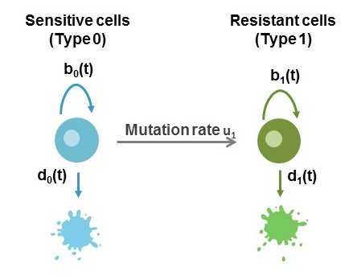


ACESO is very flexible when defining functions and allows use of other packages for estimation throughout, but the general workflow for the process is used in the analysis and summarized by the following diagram:

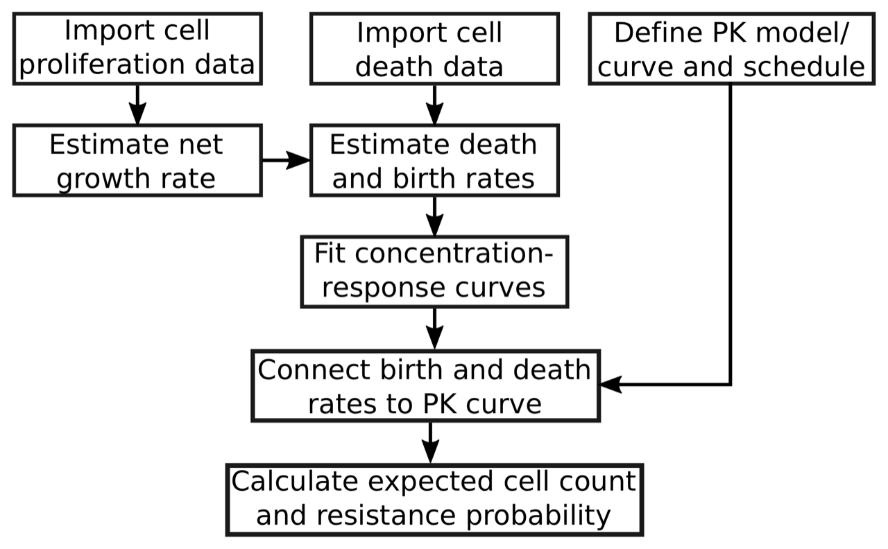


```
library(ACESO)
library(mrgsolve)
library(ggplot2)
```

### 1.) Import cell proliferation data:

Use **read.cellcount.data** function to create a data.frame with the info about cell proliferation under different drug concentrations.

Mandatory columns for in the .csv file:

* Viable.cells: cell count data
* Time: time point
* CONC: drug concentration

Optional columns:

* Replicate: Technical replicate. If missing the program assumes that there is only 1 replicate.
* Cell.line: Name of the cell line. If missing the function introduces the name 'Cell line 1'.
* Type: numerical column specifiying the cell type (0: sensitive cells, 1: resistant cell to drug A, etc.). If missing the program assumes Type=0.

```{r}
growth_data=read.cellcount.data(system.file("extdata", "cell_viability_assay.txt",
    package = "ACESO"), sep=";")
head(growth_data)
```
|Sample.ID             |Cell.line | Viable.cells| Time| Replicate| CONC| Type|Type2     | Cell_Count_0| Control| Net_growth|Death_rate |Birth_rate |
|:---------------------|:---------|------------:|----:|---------:|----:|----:|:---------|------------:|-------:|----------:|:----------|:----------|
|pc-9 par dmso 48hrs-1 |PC-9      |         0.38|   48|         1|    0|    0|sensitive |        0.062|    0.38|  0.0282163|NA         |NA         |
|pc-9 par dmso 48hrs-2 |PC-9      |         0.39|   48|         2|    0|    0|sensitive |        0.066|    0.39|  0.0282163|NA         |NA         |
|pc-9 par dmso 48hrs-3 |PC-9      |         0.33|   48|         3|    0|    0|sensitive |        0.065|    0.33|  0.0282163|NA         |NA         |
|pc-9 par E1 48hrs-1   |PC-9      |         0.29|   48|         1|    1|    0|sensitive |        0.062|    0.38| -0.0029303|NA         |NA         |
|pc-9 par E1 48hrs-2   |PC-9      |         0.29|   48|         2|    1|    0|sensitive |        0.066|    0.39| -0.0029303|NA         |NA         |
|pc-9 par E1 48hrs-3   |PC-9      |         0.31|   48|         3|    1|    0|sensitive |        0.065|    0.33| -0.0029303|NA         |NA         |

Two new columns are created:

* Cell_Count_0: cell count at time 0.
* Control: cell count when there is no drug concentration

```{r}
ggplot(data=growth_data,aes(x=Time,y=Viable.cells,col=factor(CONC)))+geom_point()+
  geom_smooth(se=F,method="lm")+facet_wrap(~Type)+
  scale_y_continuous(trans="log")+ylab("Viable cells (log scale)")+
  scale_colour_discrete(name="Dose (µM)")
```
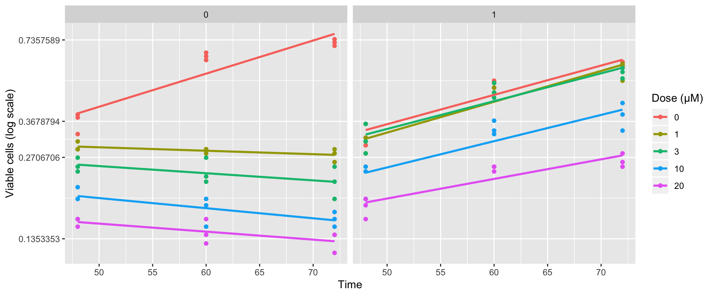


### 2.) Import cell death data:

Call **read.celldeath.file** to create a data.frame with the info about the total count of dead cells under different drug concentrations.

Necessary columns to be in the .csv file:

* Time: time point
* column.name:  name of the column where the fraction of dead cells or the total count of dead cells is stored.
* CONC: drug concentration
```{r}
cell_death=read.celldeath.file(system.file("extdata", "apoptosis_assay.txt",
    package = "ACESO"),column.name="Apoptotic.fraction",sep=";")
head(cell_death)
```
|Cell.line | Time| Apoptotic.cells| Apoptotic.fraction| Replicate| CONC| Type|Type2     | Apoptosis_time0|
|:---------|----:|---------------:|------------------:|---------:|----:|----:|:---------|---------------:|
|PC-9      |    0|       0.0304749|               9.25|         1|    0|    0|sensitive |            9.25|
|PC-9      |    0|       0.0275048|               8.99|         2|    0|    0|sensitive |            8.99|
|PC-9      |    0|       0.0221082|               7.71|         3|    0|    0|sensitive |            7.71|
|PC-9      |    0|       0.0218684|               9.25|         1|    1|    0|sensitive |            9.25|
|PC-9      |    0|       0.0198791|               8.99|         2|    1|    0|sensitive |            8.99|
|PC-9      |    0|       0.0230498|               7.71|         3|    1|    0|sensitive |            7.71|


Exploratory plot:
```{r}
library(dplyr)
my_sum <- cell_death %>%
  group_by(CONC,Time,Type2) %>%
  summarise(
    n=n(),
    mean=mean(Apoptotic.fraction),
    sd=sd(Apoptotic.fraction)
  )

ggplot(cell_death[cell_death$Time!=0,])+
  geom_bar(data=my_sum[my_sum$Time!=0,],
           aes(x=as.factor(Time), y=mean,fill=as.factor(CONC),color=as.factor(CONC)),
           stat="identity", alpha=0.7, position=position_dodge(0.9)) +
  geom_jitter(aes(x=as.factor(Time), y=Apoptotic.fraction,color=as.factor(CONC)), size=0.9,
              position=position_dodge(0.9))+
  facet_wrap(~factor(Type2,levels=c("sensitive","resistant")))+
  xlab("Time (hours)")+ylab("Fraction of death cells")+
  geom_errorbar(data=my_sum[my_sum$Time!=0,],
                aes(x=as.factor(Time), ymin=mean-sd, ymax=mean+sd,color=as.factor(CONC)),
                width=.2, position=position_dodge(0.9))+
  theme_bw()+scale_color_brewer(name="Erlotinib concentration (µM)",palette="Spectral")+
  scale_fill_brewer(name="Erlotinib concentration (µM)",palette="Spectral")+
  theme(text = element_text(size=14))+theme(legend.position="top")
```

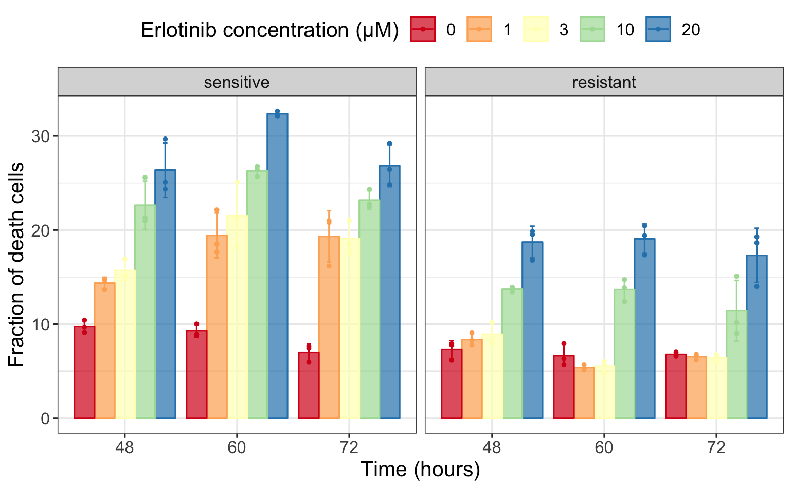

### 3.) Calculate net growth rate from cell proliferation data:
In order to calculate the net growth of each cell type, we perform a linear regression on log-transformed viable cells over time as we assume an exponentially growing population of cells. In this exercise, we decided not to use the data corresponding to time = 0 to calculate those rates.

```{r}
growth_data<-net_growth_rate(growth_data,time0_data = F)
head(growth_data) #See the values in Net_growth column
```
|Sample.ID             |Cell.line | Viable.cells| Time| Replicate| CONC| Type|Type2     | Cell_Count_0| Control| Net_growth|Death_rate |Birth_rate |
|:---------------------|:---------|------------:|----:|---------:|----:|----:|:---------|------------:|-------:|----------:|:----------|:----------|
|pc-9 par dmso 48hrs-1 |PC-9      |         0.38|   48|         1|    0|    0|sensitive |        0.062|    0.38|  0.0282163|NA         |NA         |
|pc-9 par dmso 48hrs-2 |PC-9      |         0.39|   48|         2|    0|    0|sensitive |        0.066|    0.39|  0.0282163|NA         |NA         |
|pc-9 par dmso 48hrs-3 |PC-9      |         0.33|   48|         3|    0|    0|sensitive |        0.065|    0.33|  0.0282163|NA         |NA         |
|pc-9 par E1 48hrs-1   |PC-9      |         0.29|   48|         1|    1|    0|sensitive |        0.062|    0.38| -0.0029303|NA         |NA         |
|pc-9 par E1 48hrs-2   |PC-9      |         0.29|   48|         2|    1|    0|sensitive |        0.066|    0.39| -0.0029303|NA         |NA         |
|pc-9 par E1 48hrs-3   |PC-9      |         0.31|   48|         3|    1|    0|sensitive |        0.065|    0.33| -0.0029303|NA         |NA         |

### 4.) Calculate death rate:
Use the data from cell apoptosis assays and the data where the net growth rate parameters have been calculated  to compute the death rate parameter. Call **calculate_death_rate** for this purpose. You must also specify the column name where the apoptotic cell count or the apoptotic cell fraction is stored, and finally specify if this column stores a fraction or the total counts by setting the argument 'Apoptotic.fraction' to TRUE or FALSE.
```{r}
all.data=calculate_death_rate(net_growth_data=growth_data,cell_death_data =cell_death,
                              column.name = "Apoptotic.fraction",Apoptotic.fraction = T)
```

Plot the resulting death and birth rates for each cell type:
```{r}
ggplot(all.data,aes(x=CONC,y=Death_rate))+geom_point()+scale_y_continuous(limits = c(0, 0.05))+
  facet_wrap(~Type)+ylab("Death rates (1/h)")+xlab("Drug concentration (µM)")
```
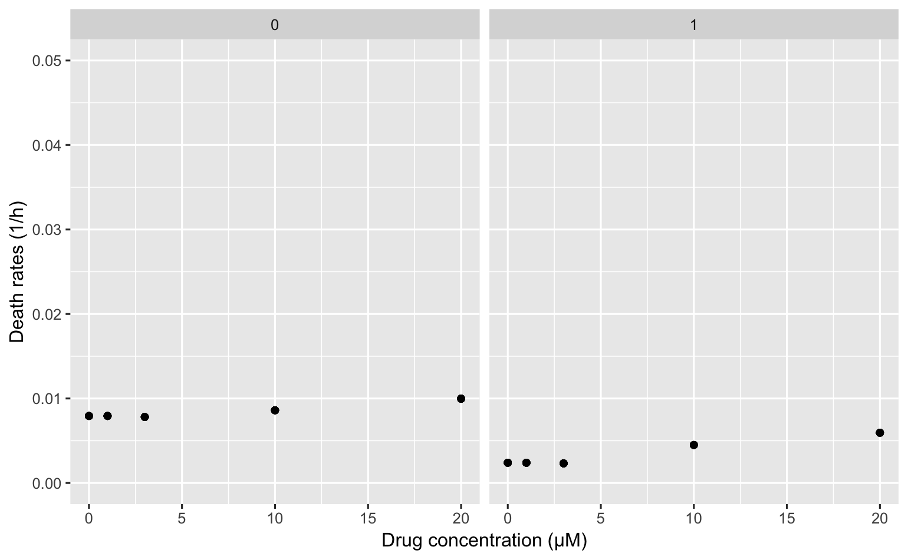

```{r}
ggplot(all.data,aes(x=CONC,y=Birth_rate))+geom_point()+facet_wrap(~Type)+
  ylab("Birth rates (1/h)")+xlab("Drug concentration (µM)")
```
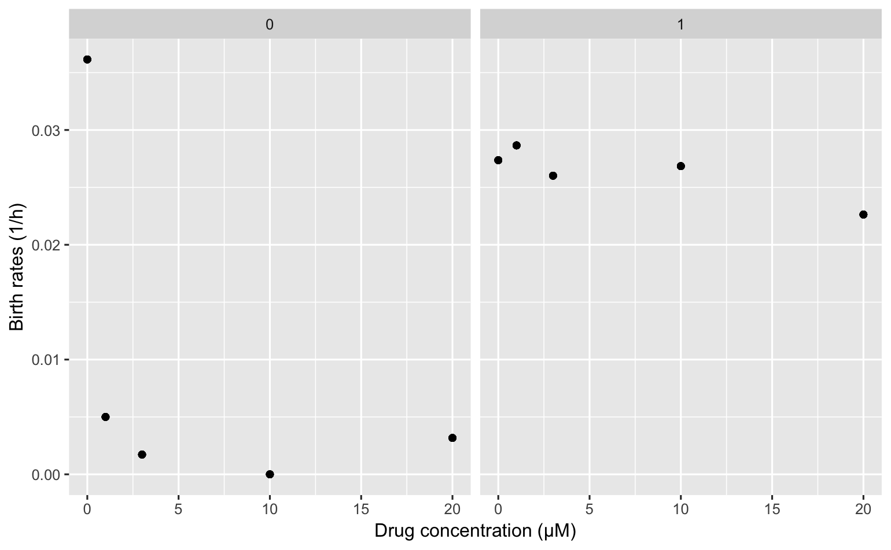


### 5.) Fit the curves
Call  **Multiple.best.singlefit** function to fit the concentration-response curves.
In this example we only have data from one cell.line (PC-9), but this function is able to fit multiple cell lines.

To perform this task easily and faster, we included the flexible and built-in model functions of the drc R package. drc was developed to provide nonlinear model fitting for dose-response analysis and it already includes the most common function to fit this type of curves. To see all the different built-in functions included in the package write: drc::getMeanFunctions().  **Multiple.best.singlefit** tries all the different models of drc library and selects the best one for you based on AIC or BIC (by default AIC is used).

```{r}
#Fit birth rates
BR.fit=Multiple.best.singlefit(all.data,resp="Birth_rate")
#Fit death rates
DR.fit=Multiple.best.singlefit(all.data,resp="Death_rate")
# BR.fit and DR.fit object coefficients given in vignette
```

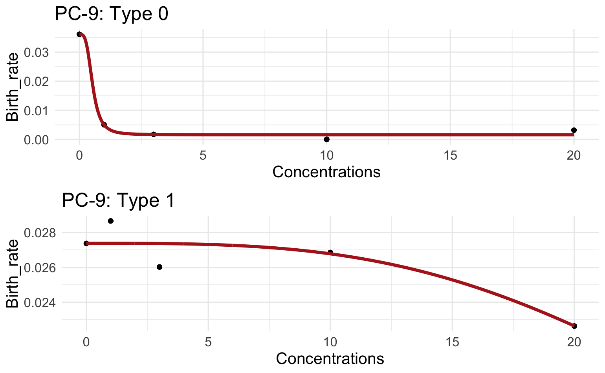

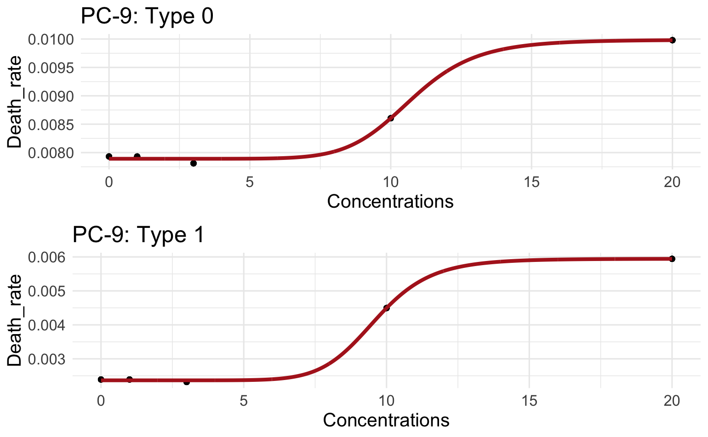


If the user wants to check all the models that has been compared for a particular cell type, **best.singlefit** can be used. Here we are going to check all the models tested for the birth rates of the resistant cell line (Type=1):

```{r}
best.singlefit(all.data[all.data$Type==1,],resp="Birth_rate",compare=T)
#Some error messages might appear because not all the models tested are able to fit the data. Ignore them.
```
|      |    logLik|         IC|   Res var|
|:-----|---------:|----------:|---------:|
|LL.3  | 255.27078| -502.54155| 0.0000007|
|W1.3  | 255.21138| -502.42276| 0.0000007|
|L.4   | 255.49166| -500.98332| 0.0000008|
|LN.3  | 254.31487| -500.62974| 0.0000008|
|W1.4  | 255.17471| -500.34941| 0.0000008|
|LL.4  | 255.15445| -500.30890| 0.0000008|
|LN.4  | 255.10483| -500.20966| 0.0000008|
|L.5   | 255.35926| -498.71851| 0.0000008|
|LL.5  | 255.29987| -498.59974| 0.0000008|
|L.3   | 248.80093| -489.60186| 0.0000010|
|EXD.2 | 247.58061| -489.16122| 0.0000010|
|G.3   | 248.54696| -489.09393| 0.0000010|
|EXD.3 | 244.73643| -481.47285| 0.0000012|
|W2.4  | 237.02145| -464.04290| 0.0000017|
|G.4   | 230.44421| -450.88843| 0.0000023|
|LL.2  |  99.72256| -193.44512| 0.0007285|
|G.2   |  99.72256| -193.44512| 0.0007285|
|W1.2  | -26.43647|   58.87294| 0.1984019|


If the user does not want to use the best model selected by  **Multiple.best.singlefit** function, **Multiple.singlefit**  can be used which allows to fit the data with the model selected by the user in the fct argument.
In this example, a 4 parameter log-logistic function (called LL.4) is selected to fit the birth rate vs concentration curve of resistant cells (Type=1):

```{r}
B1.fit=Multiple.singlefit(all.data[all.data$Type==1,],fct=drc::LL.4(),resp="Birth_rate")
```

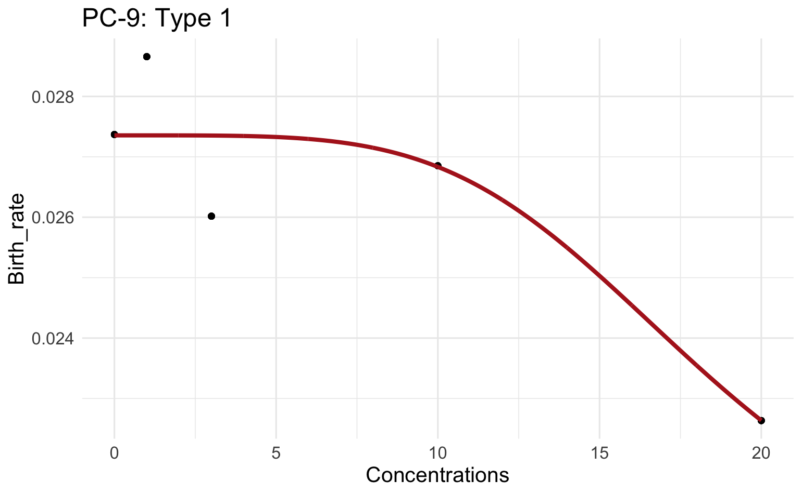

The ***drc*** package only includes non-linear functions to fit the concentration-response curves.
Thus, to select a simple linear function to fit the data, linear.model = T must be specified.

```{r}
B1.fit=Multiple.singlefit(all.data[all.data$Type==1,],resp="Birth_rate",linear.model = T)
```

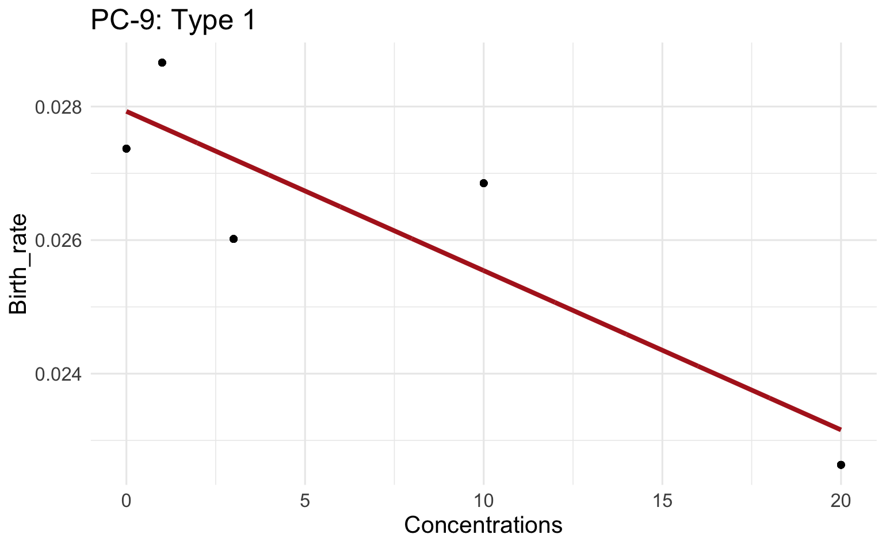


### 6.) Pharmacokinetics
Now we need to define the pharmacokinetics (PK) of the drug. To this end, we use the PK model developed by Lu et al. 2016 (\url{https://doi.org/10.1016/j.clpt.2006.04.007}) and the mrgsolve package to simulate the chosen model.

We select a 1 compartment model with extravascular administration. Read the model:
```{r}
model_library(list=T)

cmt1_ev <- mread("1cmt_ev", model_library()) %>% Req(CP)
see(cmt1_ev)
```

The model has different parameters with default values:
```{r}
param(cmt1_ev)
```
| TVCL| TVV| TVKA|  F| ALAG|
|----:|---:|----:|--:|----:|
|    2|  20|    1|  1|    0|

* TVCL: Typical value for the clearance (volume/time)
* TVV: Typical value for the volumen of distribution
* TVKA: Typical value for the first order absorption rate constant.
* F: Bioavailability
* ALAG: Lag time

Change parameter values to the ones defined in the original publication:

```{r}
newpar <-  list('TVCL' = 3.95, #L/h
          'TVV'  = 233,  #L
          'TVKA' = 0.95) #h-1
```

Define the dosing event: #A dose of 150mg
```{r}
e1 <-  ev(amt = 150, ii = 0, addl = 0, time=0)
# amt: amount
# ii: dosing interval
# addl: additional doses
# time: time when the dose is given.
```
Simulate the model with easy.mrgsim function (simplified version of mrgsim function in mrgsolve package)
```{r}
easy.mrgsim(model=cmt1_ev,dosing_schedule=e1,delta=0.1,tend=48,parameters = newpar) %>% plot
```
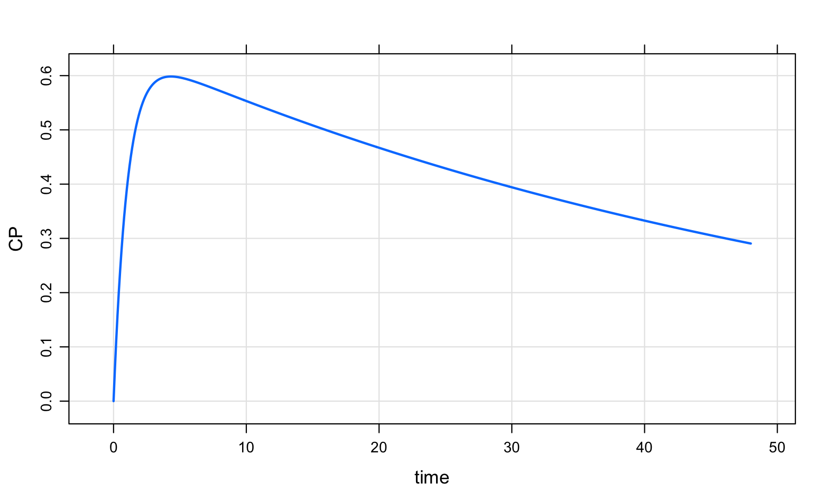

Now we are going to simulate a continuous daily dosing of 150mg for a month. For this we will change the dosing event but also de parameter values to have them in day units instead of hours:
```{r}
e2 <-  ev(amt = 150, ii = 1, addl = 30, time=0) #150 mg every day for 30 days
easy.mrgsim(model=cmt1_ev,dosing_schedule=e2,delta=0.1,tend=30,
            parameters = list(TVCL=3.95*24,TVV=233,TVKA=0.95*24)) %>% plot(scales=list(cex=1.5))

```
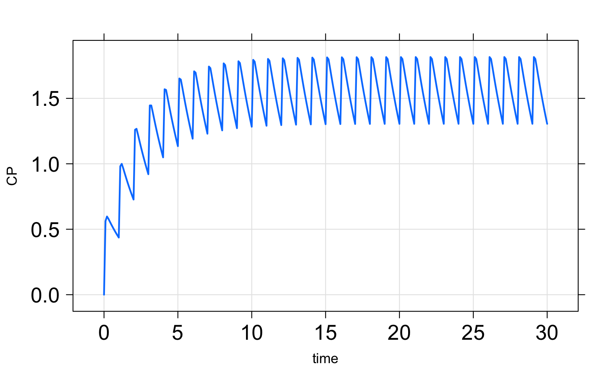

To change the concentration units from mg/L to microM use the scale argument:
```{r}
easy.mrgsim(model=cmt1_ev,dosing_schedule=e2,delta=0.1,tend=30,
            parameters = list(TVCL=3.95*24,TVV=233,TVKA=0.95*24),scale=1000/429.9) %>%
plot(scales=list(cex=1.5))

```
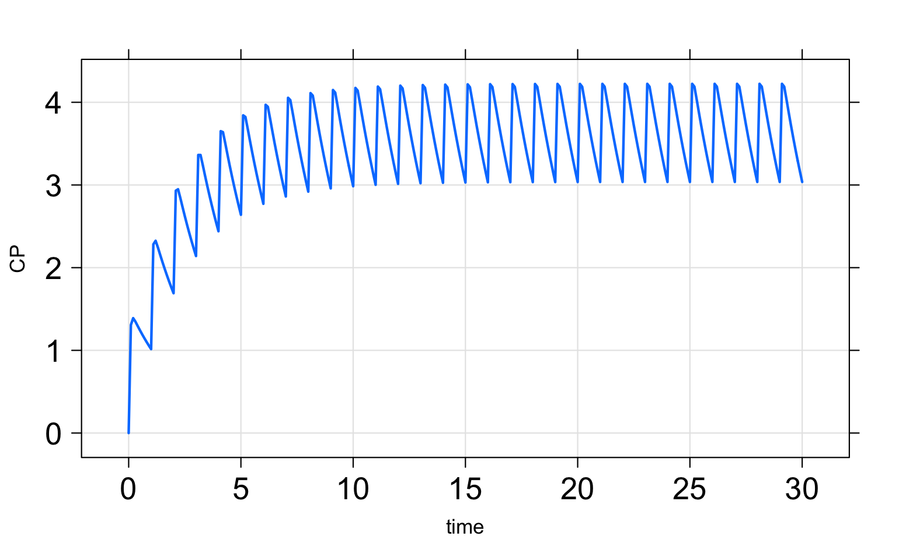

To simulate more complex dosing regimens, there is a vignette available in ACESO.

If the user is happy with the simulated pk model, then we need to define a pk function to be used during the simulation:
```{r}
pk=pk.function(model=cmt1_ev,dosing_schedule=e2,tend=30,
               parameters = list(TVCL=3.95*24,TVV=233,TVKA=0.95*24),scale=1000/429.9)
```
If the user doesn't want to use mrgsolve to define the pk model, he/she can define his/her own function.

For example,
```{r eval=FALSE}
pk2=function(t, Cp0,k, time_interval,time_first_dose=0){
  n = floor((t-time_first_dose)/time_interval) + 1
  Cp<-Cp0*(1-exp(-k*n*time_interval))*
    exp(-k*((t-time_first_dose)-(n-1)*time_interval))/(1-exp(-k*time_interval))
  return(Cp)
}
```
Additionally, a csv with pharmacokinetic data can be uploaded to fit a curve selecting one of the pk models from the model library. Use **Estimate.PK** function for this purpose (see the help function for an example). For complex pk models or data, we recommend the use of NONMEM, MONOLIX or other parameter estimation software.


### 7.) Define sensitive and resistant cells
We need to define the sensitive (Type 0) and resistant cells (Type 1) to perfom the simulations.

To define cell types the following arguments are needed:

* N0: initial cell population.
* birth_rate: birth rate function. It can be a numeric value, a user defined function or the result of a model fitting function. If the user provides a numeric value, it is assumed that the birth rate remains constant during the simulation.
* death_rate death rate function. It can be a numeric value, a user defined function or the result of a model fitting function.If the user provides a numeric value, it is assumed that the death rate remains constant during the simulation.
* scale: scaling parameter.
* pk.function: name of the pharmacokinetic function that will affect to the rates of the cells.

For the resistant cell types, an additional argument is needed:
* mutation_rate: Numeric or function specifying the mutation rates for the cell type defined.

We will use the previously fitted functions for the birth rates and constant values for the death rates as the variation of death rate values for the different drug concentrations is very low. We assume the population begins with 10^6 sensitive cells and no resistant cells.

```{r}
Type0 <-define.Type0.cells(N0=10^6,birth_rate = 'BR.fit[[1]]',death_rate= 0.0085,scale=24,
                           pk.function = 'pk')
#The function returns a S4 object with all the information gathered together.
#For resistant cells and additional argument is needed: mutation_rate
Type1 <-define.Typei.cells(Ni=0,birth_rate = 'B1.fit[[1]]',death_rate  = 0.0035, mutation_rate=10^-8,
    scale=24, pk.function = 'pk')
```

To see how the birth rate of the cells change over time due to the pharmacokinetics of the drug:
```{r}
plot(seq(0,30,0.1),Type0@b0(seq(0,30,0.1)),type='l',xlab='Time',ylab='b0')
plot(seq(0,30,0.1),Type1@bi(seq(0,30,0.1)),type='l',xlab='Time',ylab='b1')
```

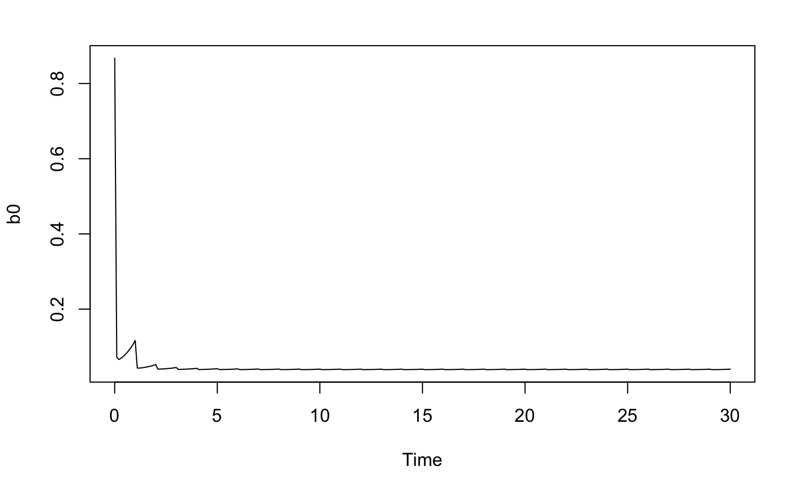 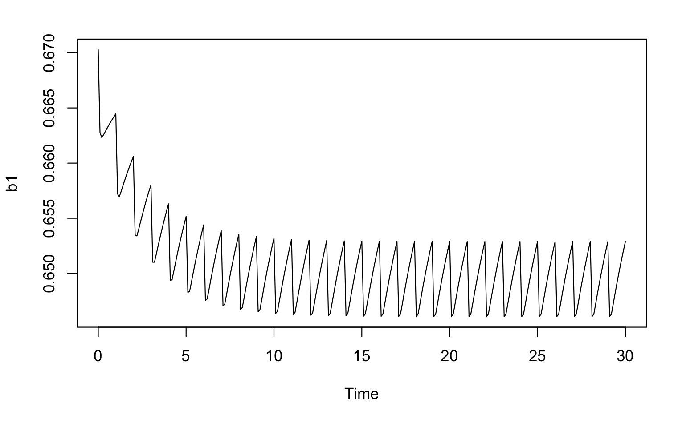

### 8.) Calculate the expected number of sensitive cells over time:
In order to calculate the expected number of sensitive cells over time use **EN_type0_cells** function with the following arguments:
* t: time (numeric).
* type_0: Type-0 S4 object with the information of the sensitive cell population.
* ui: mutation rate of the resistant population (numeric).
* int.function: integration function to use in R. Options are "integrate" from base R or "pracma" which uses functions from the pracma package. "pracma" is more robust but slower than "integrate".
```{r}
 EN_type0_cells(t=10,type_0=Type0,ui=c(Type1@ui))
 # 207930.3
 EN_type0_cells(t=10,type_0=Type0,ui=c(Type1@ui),int.function="pracma")
 # 207929.9
```

This function gave us the number of sensitive cells at 10 days. To do this for a vector of times:
```{r}
sapply(seq(0,30,1),function(i){ EN_type0_cells(t=i,type_0=Type0,ui=c(Type1@ui))})
```

### 9.) Calculate the number of resistant cells and probability of resistance
In order to calculate the expected number of resistant cells, use **En_resistant_cells_i** function with the following arguments:

* N: the total number of the resistant cell types.
* t: time
* type_0: Type-0 S4 object
* type_i: list with all the Type-i S4 objects
* approximation: logical argument indicating if an approximation of the numerical integration method must be used or not. Default to TRUE for faster computation.

```{r eval=FALSE}
En_resistant_cells(N=1,t=10,type_0=Type0,type_i=list(Type1))
```
To do this for a vector of different times:
```{r eval=FALSE}
sapply(c(0,2,4,8),function(i){En_resistant_cells(N=1,t=i,type_0=Type0,type_i=list(Type1))})

```
To calculate the probability of resistance use **Prob_resistance** function with the following arguments:

* t: time of production of a resistant cell clone
* type_0: Type-0 S4 object
* type_i: list with all the Type-i S4 objects
* N: number of resistant cell clones

```{r, eval=FALSE}
Prob_resistance(t=10,type_0=Type0,type_i=list(Type1),N=1)
#Note: very time-consuming function:
```
