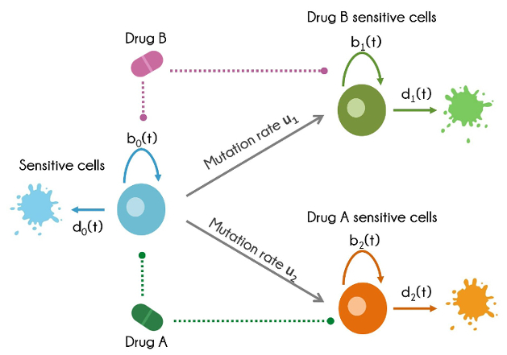

```{r setup, include = FALSE}
knitr::opts_chunk$set(
  collapse = TRUE,
  comment = "#>",
  warnings= FALSE
)
```
Let us consider the three-type birth-death process shown in Figure 2. This model is
extensively used in investigating the dynamics of tumor cells in response to treatment, where a population initially sensitive to therapy will gain resistance via mutation and expand at a different rate. In this example, the sensitive cell type (type 0, blue) is sensitive to both drugs A and B and proliferates and dies with rate b0 and d0 respectively. Type 0 cells are able to mutate to give two different cell types, type 1 (green) and 2 (orange) which will be resistant to one of the drugs. 



Load libraries:
```{r}
library(ACESO)
library(ggplot2)
```

## Data
In the current evaluation cell viability data resulting from the exposure of BT-20 triple-negative breast cancer cell line  to different concentration values of two small molecule kinase inhibitors (alpelisib and trametinib) is analyzed. The data was obtained from the HMS LINCS database (\url{https://lincs.hms.harvard.edu/}).

```{r}
data(Alpelisib_Trametinib_combination)
head(Alpelisib_Trametinib_combination)

DrugA=as.character(Alpelisib_Trametinib_combination$Drug.Name[1])
DrugB=as.character(Alpelisib_Trametinib_combination$Drug2.Name[1])
print(c(DrugA,DrugB))
```

Exploratory analysis of the data:

```{r}
ggplot(data=Alpelisib_Trametinib_combination,aes(x=(CONC),y=Viable.cells,col=factor(CONC2)))+
  geom_point(size=1.5)+
  xlab(paste0("[",DrugA,"] (µM)"))+scale_colour_discrete(name=paste0("[",DrugB,"] (µM)"))+
  theme_classic()+theme(text = element_text(size=14))
```

BT-20 cells sensitive to both drugs were defined as type 0 cells, whereas cells resistant to trametinib and alpelisib were defined as type 1 and type 2 cells respectively. 

# Dynamics of sensitive cells:

## Calculate net growth rate
Calculate the net growth rates of the BT-20 cell type for every concentration of the two drugs. Use the **net_growth_rate** function for this purpose, where an exponential growth function is assumed to calculate those rates.
```{r}
growth_data<-net_growth_rate(Alpelisib_Trametinib_combination)
head(growth_data)
```
Plot the results:
```{r}
ggplot(data=growth_data,aes(x=(CONC),y=Net_growth,col=factor(CONC2)))+geom_point()+geom_line(linetype="dashed")+
  theme(text = element_text(size=14))+xlab(paste0("[",DrugA,"] (µM)"))+
  scale_colour_discrete(name=paste0("[",DrugB,"] (µM)"))+
  theme_classic()+ylab("Net growth (1/h)")+theme(text = element_text(size=14))
```

## Calculate birth and death rates
As in the LINCS database there is no information regarding apoptosis assays available to estimate the death rate of type 0 cells (d0) and assuming that these targeted therapies do not induce cell death per se, a different d0 value was defined for each combination of the drugs, which was equal to the minimum value needed to ensure that all the birth rates of type 0 cells (b0) were positive regardless of the treatment conditions:
```{r}
d0=vector("list", length = length(unique(growth_data$Cell.line)))
names(d0)=unique(as.character(growth_data$Cell.line))
d0[[1]]=-min(growth_data$Net_growth)
d0
```

We use the **net_growth_rate** function again, not only to calculate the net growth rate parameter of the cells but also the birth and death rates. To this end, we introduce the newly calculated d0 value:
```{r}
growth_data<-net_growth_rate(growth_data,death_rate = d0)
ggplot(data=growth_data,aes(x=(CONC),y=Birth_rate,col=factor(CONC2)))+geom_point()+geom_line(linetype="dashed")+
  theme(text = element_text(size=14))+xlab(paste0("[",DrugA,"] (µM)"))+
  scale_colour_discrete(paste0("[",DrugB,"] (µM)"))+
  theme_classic()+ylab("Birth rate of \n sensitive cells, b0 (1/h)")+theme(text = element_text(size=14))

```

Another plot type to analyze the response surface of the data:
```{r}
#We are going to remove the columns that are not necessary for the analysis of the data in this example:
GD=growth_data[,c('Cell.line','CONC','CONC2','Net_growth','Type','Birth_rate','Death_rate')]
GD=unique(GD)
```
Use **responseMap** function to reorganize the data to easily plot the surface of the birth rate values versus both drug concentrations:
```{r}
rmap <- responseMap(Birth_rate~CONC+CONC2,GD,logscale=T,interpolate=FALSE)
DifferenceSurface.plot(rmap,zcenter=max(growth_data$Birth_rate)/2,
                       xl=paste0("[",DrugA,"] (µM)"),
                       yl=paste0("[",DrugB,"] (µM)"),
                       zl="Birth rate of \n sensitive cells, b0 (1/h)",
                       mid="yellow",low="hotpink1",high="darkturquoise")

```

Use **responseMap** again and **plot.ResponseSurface** to make a contour plot of the data. For this plot a interpolation of the data is needed (see logscale=T in the **responseMap** function):
```{r}
rmap <- responseMap(Birth_rate~CONC+CONC2,GD,logscale=T)

ResponseSurface.plot(rmap,xl=paste0("[",DrugA,"] (µM)"),
                     yl=paste0("[",DrugB,"] (µM)"),
                     zl="Birth rate of \n sensitive cells, b0 (1/h)",
                     palette=c("hotpink1","yellow","darkturquoise"))

```

## Sensitive cell model fitting
Birth rate parameters were fitted nonparametrically using a Generalized Additive Model (GAM) to generate the predicted surface required for the simulation of the evolutionary process:
```{r}
gam.model=Multiple.resp.surface.fit(GD, title=", GAM",Drug1.name=paste0("[",DrugA,"] (µM)"),Drug2.name=paste0("[",DrugB,"] (µM)"))
```

## Dynamics of resistant cells:
In the HMS LINCS database there is no information about resistant cell lines for these drugs, even so, we create the data to evaluate the dynamics of Type 1 (resistant to trametinib) and Type 2 (resistant to alpelisib) cells to show a more complete example of the type of analysis that can be conducted using ACESO.

Let's start analyzing the dynamics of alpelisib-sensitive/trametinib-resistant cell type (Type 1).
```{r}
 data(Alpelisib_sensitive)
 head(Alpelisib_sensitive)
 ggplot(data=Alpelisib_sensitive,aes(x=CONC,y=Birth_rate))+geom_point()+theme_bw()

```

Fit the birth rates with the **Multiple.best.singlefit** function:
```{r}
#Some error messages might appear because not all the models tested are able to fit the data. Ignore them.
B1=Multiple.best.singlefit(data=Alpelisib_sensitive,resp='Birth_rate')
B1
```

The best function is a expontenial decay model (named EXD.3) with an upper limit of 0.023 1/h, a lower limit of 0.0126 1/h and a steepness of decay of 3.047 µM.

Now, we will repeat this process for the trametinib-sensitive/alpelisib-resistant cell type (Type 2).

```{r}
 data(Trametinib_sensitive)
 head(Trametinib_sensitive)
 ggplot(data=Trametinib_sensitive,aes(x=CONC2,y=Birth_rate))+geom_point()+theme_bw()

```

Fit the birth rates with the **Multiple.best.singlefit** function:
```{r}
B2=Multiple.best.singlefit(data=Trametinib_sensitive,resp='Birth_rate',conc = "CONC2")
B2
```

If the user wants to check all the models that has been compared for a particupar type of cells, **best.singlefit** can be used. Here we are going to check all the models tested for the birth rates of the alpelisib-resistant cell line (Type=2):
```{r}
best.singlefit(Trametinib_sensitive,resp="Birth_rate",conc = "CONC2",compare=T)
```

## Define drug pharmacokinetic model:
The pharmacokinetic model defined for alpelisib is based on the model from De Buck et al. 2014, whereas for trametinib we used the model defined in Ouellet et al. 2016.
```{r}
library(mrgsolve)
#Alpelisib
cmt1_oral<- mread("1cmt_ev", model_library())
#Trametinib: 
cmt2_oral<- mread("2cmt_ev", model_library())
see(cmt2_oral)

```

Simulate the drug concentration profile for trametinib when a 2mg dose is given every day for a month:
```{r}
e2 <- ev(amt = 2, time=0, ii=1, addl=30)
easy.mrgsim(model=cmt2_oral,dosing_schedule=e2,delta=0.1,tend=30,parameters = list(TVCL=4.91*24,TVV=214,TVKA=2.05*24,Vp=568,Q=60*24),scale=1000/615.4,Req="CP") %>% plot(scales=list(cex=1.5))
```

## Define all the cell types:
Now we need to use **define.Type0.cells** and **define.Typei.cells** functions to define all the cell types that we have in our problem.

To define cell types the following arguments are needed:

* N0: initial cell population.
* birth_rate: birth rate function. It can be a numeric value, a user defined function or the result of a model fitting function. If the user provides a numeric value, it is assumed that the birth rate remains constant during the simulation.
* death_rate death rate function. It can be a numeric value, a user defined function or the result of a model fitting function.If the user provides a numeric value, it is assumed that the death rate remains constant during the simulation.
* scale: scaling parameter.
* pk.function: name of the pharmacokinetic function that will affect to the rates of the cells.

For the resistant cell types, an additional argument is needed:

* mutation_rate: Numeric or function specifying the mutation rates for the cell type defined.

To start with our simulations, we will define a inial number of 10^6 sensitive cells and 1000 resistant cells o each type. The mutation rate is equal to 10^-7.
```{r}
Type0 <-define.Type0.cells(N0=10^6,birth_rate = 'gam.model[[1]]',death_rate= 0.03,scale=24,pk.function = c('pk1','pk2'))

Type1 <-define.Typei.cells(Ni=1000,birth_rate = 'B1[[1]]',death_rate  = 0.015,mutation_rate=10^-7,scale=24,pk.function='pk1')

Type2 <-define.Typei.cells(Ni=1000,birth_rate = 'B2[[1]]',death_rate  = 0.01,mutation_rate=10^-7,scale=24,pk.function='pk2')
```

### Simulate the number of sensitive and resistant cells over time:
Fist define the dosing schedules for each drug:
```{r}
#Alpelisib: 300mg/day
e1 <- ev(amt = 300, ii = 1, addl = 60, time=0)
pk1=pk.function(model=cmt1_oral,dosing_schedule=e1,tend=50,parameters = list(TVCL=11.5*24,TVV=118,TVKA=0.784*24,ALAG=0.489/24),scale=1000/441.47) 

#Trametinib: 2mg/day
e2 <- ev(amt = 2, time=0, ii=1, addl=60)
pk2=pk.function(model=cmt2_oral,dosing_schedule=e2,tend=50,parameters = list(TVCL=4.91*24,TVV=214,TVKA=2.05*24,Vp=568,Q=60*24),scale=1000/615.4) 
```
Calculate the number of sensitive cells after a week of treatment (7 days):
```{r}
EN_type0_cells(t=7,type_0=Type0,ui=c(Type1@ui,Type2@ui))
```
Remember the meaning of each argument:
* t: time.
* type_0: Type-0 S4 object with the information of the sensitive cell population.
* ui: mutation rates of the resistant population.


```{r}
En_resistant_cells(N=2,t=7,type_0=Type0,type_i=list(Type1,Type2))
```
* N: the total number of the resistant cell types. 2 in this example.
* t: time 
* type_0: Type-0 S4 object
* type_i: list with all the Type-i S4 objects